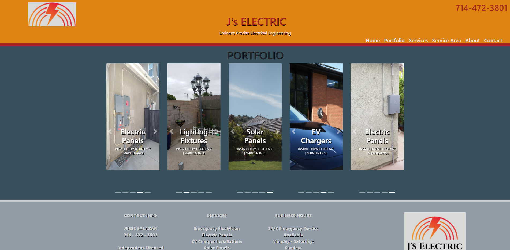
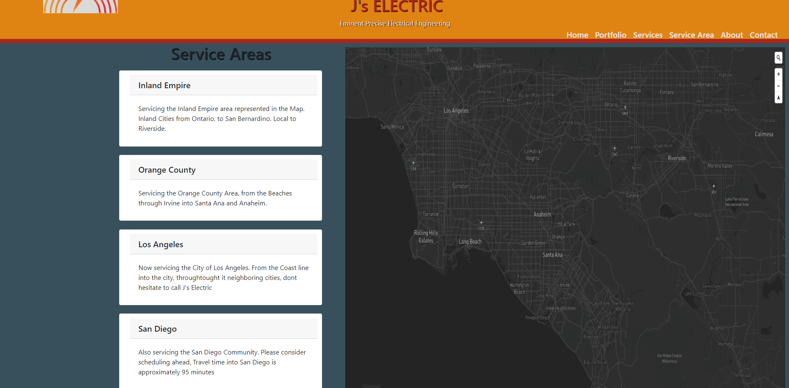
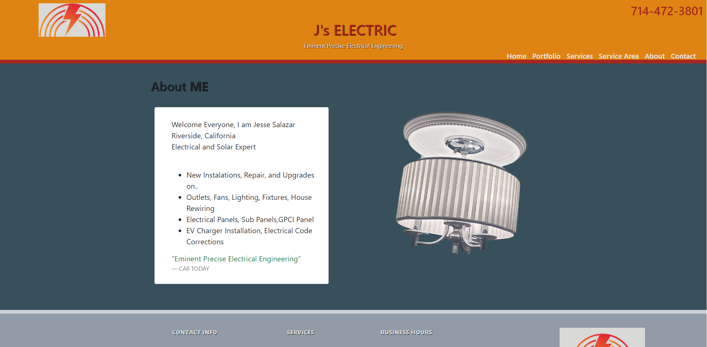
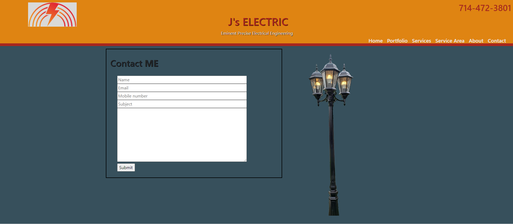

#

# AEG Codes ✨

<h1  align="center"> J's Electric ⚡

# Description
## React Web Application for an Independent License Electrical Contractor
 

  

  

  

  

  

 

 &nbsp;
 &nbsp;
 &nbsp;

 &nbsp;
 &nbsp;

<h3 align="center">
    🔹
    <a href="https://github.com/CdmMandalorian/Armando-E-Galindo-ReactPortfolio/issues">Report Bug</a> &nbsp; &nbsp;
    🔹
    <a href="https://github.com/CdmMandalorian/Armando-E-Galindo-ReactPortfolio/issues">Request Feature</a>
</h3>

 

# Live Site View:

 

Visit J's Electric [here](https://cdmmandalorian.github.io/JsElectric/ "Link to J's Electric").
       
 

# Built With

This project was built using these technologies.

- React.js
- Node.js
- Express.js
- CSS3
- Bootstrap
- React-Bootstrap
- Typescript
- VSCode
- FontAwesome

# Features

**📖 Multi-Page Layout**

**🎨 Styled with React-Bootstrap and Css**

**📱 Fully Responsive**

## Getting Started

Clone down this repository. You will need `node.js` and `git` installed globally on your machine.

## 🛠 Installation and Setup Instructions

1. Installation: `npm install`

2. In the project directory, you can run: `npm start`

Runs the app in the development mode.\
Open [http://localhost:3000](http://localhost:3000) to view it in the browser.
The page will reload if you make edits.

## Usage Instructions

Open the project folder and Navigate to `/src/components/`.  
You will find all the components used and you can edit your information accordingly.
 

### Show your support

 

Give a ⭐ if you like this website!

 

# Portfolio

* Visit [here](https://cdmmandalorian.github.io/Armando-E-Galindo-ReactPortfolio/ "Link to my Portfolio") | My Personal React Portfolio which features some of my github projects as well as my resume and technical skills.*